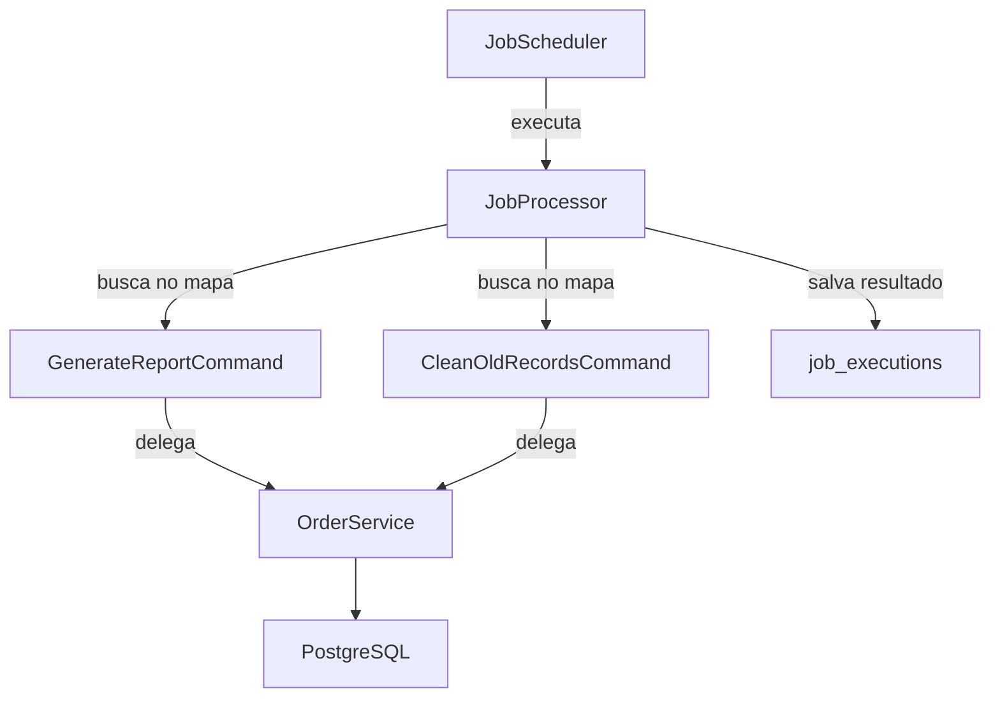

# Report Scheduler


Sistema de agendamento de jobs para monitoramento de pedidos, desenvolvido com Java 21 e Spring Boot 3.

## Tecnologias

- Java 21
- Spring Boot 3.4
- PostgreSQL
- Gradle (Kotlin DSL)
- Lombok
- JUnit 5 + Mockito

## Design Pattern

O projeto utiliza o **Command Pattern** para organizar os jobs agendados:

- `JobCommand` — interface que define o contrato de execução
- `JobProcessor` — orquestra a execução e registra o resultado no banco
- `JobScheduler` — agenda os jobs via `@Scheduled`
- `GenerateReportCommand` — gera relatório de pedidos pendentes
- `CleanOldRecordsCommand` — limpa pedidos cancelados antigos

## Arquitetura

## Arquitetura



## Jobs

### GenerateReportCommand
Executa todo dia às 08h. Busca pedidos com status `PENDING` criados há mais de 24 horas e gera alertas no log.

### CleanOldRecordsCommand
Executa todo domingo à meia-noite. Deleta pedidos com status `CANCELLED` criados há mais de 30 dias.

## Endpoints

| Método | Endpoint | Descrição |
|---|---|---|
| GET | `/api/orders` | Lista todos os pedidos |
| GET | `/api/orders/pending` | Lista pedidos PENDING com mais de 24h |
| GET | `/api/job-executions` | Lista todas as execuções dos jobs |
| GET | `/api/job-executions/summary` | Resumo de execuções com total, sucesso e falhas |


## Como executar

### Pré-requisitos
- Java 21
- PostgreSQL

### Variáveis de ambiente
Configure as seguintes variáveis de ambiente:

| Variável | Descrição |
|---|---|
| `DB_HOST` | Host do banco de dados |
| `DB_NAME_REPORT_SCHEDULER` | Nome do banco de dados |
| `DB_USER` | Usuário do banco |
| `DB_PASSWORD` | Senha do banco |

### Criando o banco
```sql
CREATE DATABASE report_scheduler_db;
```

### Rodando a aplicação
```bash
./gradlew bootRun
```

### Rodando os testes
```bash
./gradlew test
```

## Estrutura do projeto

```
src/main/java/com/guilherme/report_scheduler/
├── command/        ← interface JobCommand
├── job/            ← JobProcessor e JobScheduler
├── jobcommands/    ← ConcreteCommands
├── model/          ← entidades do banco
├── repository/     ← acesso ao banco
└── service/        ← regras de negócio
```